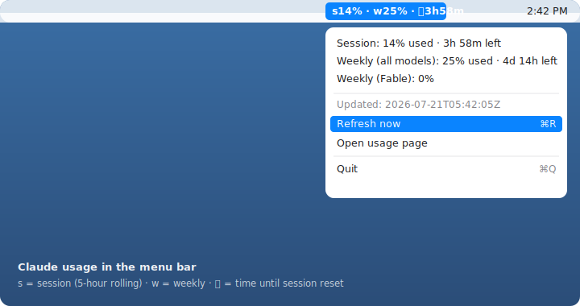

# claude-usage-menubar

A tiny native macOS menu bar app that always shows your Claude subscription (Pro/Max/Team) usage. No more opening Settings → Usage every time — see your session/weekly usage and the time left until reset at a glance.

<p align="center">
  
</p>

```
s14% · w25% · ⏳3h58m
```

`s` = session (5-hour rolling), `w` = weekly, `⏳` = time left until the session resets. Click it for the details dropdown:

```
Session: 14% used · 3h 58m left
Weekly (all models): 25% used · 4d 14h left
Weekly (Fable): 0%
─────────────
Updated: 2026-07-21T05:42:05Z
Refresh now
Open usage page
Quit
```

No third-party app like SwiftBar required. Because it only reads a local file, it triggers virtually no macOS permission prompts.

## How it works

```
launchd (1 min)   collect.sh              usage.json          ClaudeUsageBar.app (30s refresh)
   ───────────▶  parse /usage & normalize ──▶ ~/.claude-usage/ ──▶ menu bar + dropdown
```

- **Data source**: Claude Code's `claude -p "/usage" --output-format json`. This slash command is handled locally, so it **costs zero tokens/usage** (`num_turns: 0`, `output_tokens: 0`).
- **Why a daemon + cache**: calling `claude` on every render would be slow. A background daemon collects once a minute into a JSON cache, and the app just reads that file for an instant, stable display.
- **Time left** is accurate to the minute: `collect.sh` stores reset times as absolute epochs, and the app recomputes remaining time on every render.
- The web app, desktop app, and Claude Code **share the same usage pool**, so reading one source (Claude Code) reflects total usage.

## Requirements

- macOS 12+
- [Claude Code](https://claude.com/claude-code) — signed in with a subscription account (a subscription login session, not an API key)
- [`jq`](https://jqlang.github.io/jq/) — `brew install jq`
- Swift compiler — `xcode-select --install` (Command Line Tools)

## Install

```bash
git clone https://github.com/ososos888/claude-usage-menubar.git
cd claude-usage-menubar
./install.sh
```

`install.sh` registers the collector daemon and builds/installs the menu bar app with auto-start. When it's done, the menu bar shows `s..% · w..% · ⏳..`.

## Layout

| Path | Role |
|---|---|
| `collect.sh` | Parses `/usage` output into `~/.claude-usage/usage.json` (including reset epochs). Keeps the last good values on failure |
| `com.user.claude-usage.plist` | launchd agent. Runs `collect.sh` every minute; starts at login |
| `standalone/ClaudeUsageBar.swift` | Native menu bar app source (`NSStatusItem`). Reads the cache JSON, renders it, computes remaining time live |
| `standalone/build.sh` | Builds the app → `~/Applications/ClaudeUsageBar.app` → registers launchd auto-start |
| `uninstall.sh` | Removes the agents, app, and data dir (guarded; supports `--dry-run` / `-y`) |
| `swiftbar/claude_usage.1m.sh` | (Optional) plugin alternative if you prefer SwiftBar |

## Customizing

- **Collection interval**: `StartInterval` (seconds) in `com.user.claude-usage.plist`. Default 60.
- **Display refresh**: the `Timer` interval in `ClaudeUsageBar.swift` (default 30s).
- **Color thresholds**: `color(forPct:)` in `ClaudeUsageBar.swift` — default 80%+ red, 60%+ orange.

After editing, run `./standalone/build.sh` to rebuild and apply immediately.

## Uninstall

```bash
./uninstall.sh              # asks for confirmation, then removes everything
./uninstall.sh --dry-run    # show exactly what would be removed, change nothing
./uninstall.sh -y           # skip the confirmation prompt
```

It removes only what this project creates — the two launchd agents, `~/Applications/ClaudeUsageBar.app`, and `~/.claude-usage` — and never touches SwiftBar. Prefer to do it by hand? The equivalent commands:

```bash
launchctl unload ~/Library/LaunchAgents/com.ososos888.claudeusagebar.plist
launchctl unload ~/Library/LaunchAgents/com.user.claude-usage.plist
rm ~/Library/LaunchAgents/com.ososos888.claudeusagebar.plist
rm ~/Library/LaunchAgents/com.user.claude-usage.plist
rm -rf ~/Applications/ClaudeUsageBar.app ~/.claude-usage
```

## Notes

- Parsing `/usage` output is an **unofficial path**. If Anthropic changes the output format, update the parser in `collect.sh` (the app then shows `Claude --`).
- To read subscription usage, `claude` must be authenticated with a **subscription login session**. If it's authenticated via `ANTHROPIC_API_KEY`, it bills against the API and behaves differently.
- On the Team plan, limits are **per member**; this widget reflects the currently signed-in account.

## Versioning

This project follows [Semantic Versioning](https://semver.org/). See [CHANGELOG.md](CHANGELOG.md). Current version: **1.0.0**.

## License

MIT
